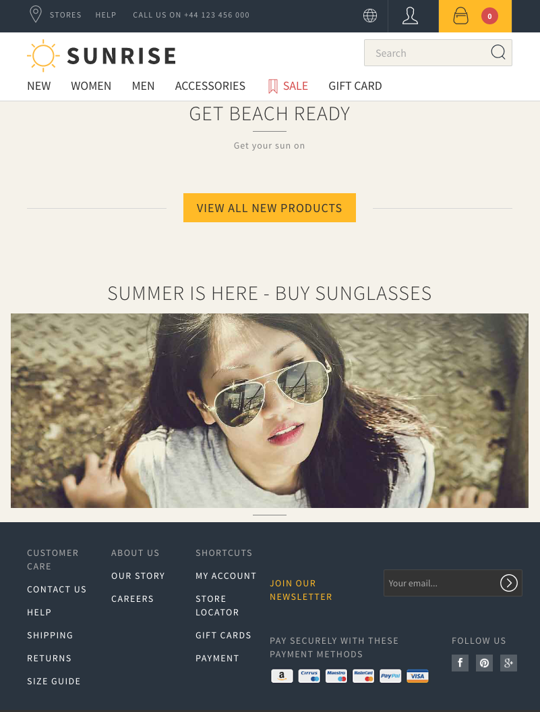

## Overriding bean factories

When a bean does not contain all the data required for the template, you can override its factory to produce a subclass of the bean.

In this example shows how to add a field `lastUpdated` to the `ProductDetailPageContent`. This procedure is not limited to page class beans.

First override the bean to add the field including getters and setters:

```java
public class MyProductDetailPageContent extends ProductDetailPageContent {
    private String lastUpdated;

    public String getLastUpdated() {
        return lastUpdated;
    }

    public void setLastUpdated(final String lastUpdated) {
        this.lastUpdated = lastUpdated;
    }
}
```

Then override the factory for the original bean:

```java
public class MyProductDetailPageContentFactory extends ProductDetailPageContentFactory {
    //here you can use dependency injection to get instances
    @Inject
    private UserContext userContext;

    //do not call here super.create because you would get a bean of the original class and not the subclass
    @Override
    public ProductDetailPageContent create(final ProductProjection product, final ProductVariant variant) {
        final MyProductDetailPageContent bean = new MyProductDetailPageContent();
        initialize(bean, product, variant);
        return bean;
    }

    //the new initialize method contains as first parameter the bean of you subclass and then the parameters of the create method
    protected final void initialize(final MyProductDetailPageContent bean, final ProductProjection product, final ProductVariant variant) {
        //use the initialize from the super class, don't forget the super, otherwise you get infinite recursion
        //also the super.initialize is final, don't try to override it
        super.initialize(bean, product, variant);

        //add here the new data
        final DateTimeFormatter formatter = DateTimeFormatter.ofLocalizedDate(FormatStyle.FULL).withLocale(userContext.locale());
        bean.setLastUpdated(product.getLastModifiedAt().format(formatter));
    }
}
```

To register the new factory you need a Guice module to override the binding for the old factory.
You can reuse this module for multiple factories.
So it could look like:

```java
import com.commercetools.sunrise.productcatalog.productdetail.MyProductDetailPageContentFactory;
import com.commercetools.sunrise.productcatalog.productdetail.ProductDetailPageContentFactory;
import com.google.inject.AbstractModule;

public class FactoryModule extends AbstractModule {
    @Override
    protected void configure() {
        bind(ProductDetailPageContentFactory.class)//the default factory class for the creation
                .to(MyProductDetailPageContentFactory.class);//the class you want to use instead

        //add more bindings for factories here
    }
}

```

To make Play know the module, add it to `application.conf`:

```
play.modules.enabled += "absolute.path.to.your.FactoryModule"
```

The final home page then looks like this:


## Handlebars View Components

The demo theme contains a [call to "components-include"](https://github.com/commercetools/commercetools-sunrise-theme/blob/master/input/templates/partials/common/footer.hbs#L1),
which contains a [list of components](https://github.com/commercetools/commercetools-sunrise-theme/blob/master/input/templates/partials/components/components-include.hbs).
A data item for this could look like:

```json
[
  {
    "templateName": "components/summercampaign/banner",
    "componentData": {
      "src": "https://sunrise.commercetools.com/assets/img/cms/woman_large-8to3.jpg",
      "width": 768,
      "height": 288,
      "href": "http://localhost:9000/summer/en"
    }
  }
]
```

In the following example we create a component that shows a banner to summer campaign.

First we create a `ControllerComponent` that adds the handlebars component to the page data:

```java
import com.commercetools.sunrise.common.contexts.UserContext;
import com.commercetools.sunrise.common.pages.PageData;
import com.commercetools.sunrise.components.ComponentBean;
import com.commercetools.sunrise.framework.ControllerComponent;
import com.commercetools.sunrise.hooks.PageDataHook;
import io.sphere.sdk.models.Base;
import play.Configuration;

import javax.inject.Inject;
import java.util.HashMap;
import java.util.Map;

public final class SummerCampaignControllerComponent extends Base implements ControllerComponent, PageDataHook {

    @Inject
    private Configuration configuration;
    @Inject
    private UserContext userContext;

    @Override
    public void acceptPageData(final PageData pageData) {
        final ComponentBean component = createComponentBean();
        pageData.getContent().addComponent(component);
    }

    private ComponentBean createComponentBean() {
        final ComponentBean component = new ComponentBean();
        //the template is in conf/templates/components/summercampaign/banner.hbs or of course your theme
        component.setTemplateName("components/summercampaign/banner");//without .hbs!!!
        Map<String, Object> data = new HashMap<>();
        data.put("src", configuration.getString("summercampaign.img.src"));
        data.put("width", configuration.getString("summercampaign.img.width"));
        data.put("height", configuration.getString("summercampaign.img.height"));
        data.put("href", demo.productcatalog.routes.SummerCampaignController.show(userContext.languageTag()).url());
        component.setComponentData(data);
        return component;
    }
}
```

You still need to wire the `ControllerComponent` to a controller or multiple controllers.
Since it make sense to put it to all controllers except for checkout, we need a Guice Module:

```java
import com.commercetools.sunrise.framework.MultiControllerComponentResolver;
import com.commercetools.sunrise.framework.MultiControllerComponentResolverBuilder;
import com.google.inject.AbstractModule;
import com.google.inject.Provides;
import demo.productcatalog.SummerCampaignControllerComponent;

public class ComponentsModule extends AbstractModule {
    @Override
    protected void configure() {
    }

    @Provides
    public MultiControllerComponentResolver multiControllerComponentResolver() {
        return new MultiControllerComponentResolverBuilder()
                .add(SummerCampaignControllerComponent.class, controller -> !controller.getFrameworkTags().contains("checkout"))
                .build();
    }
}
```

The `ComponentsModule` can be reused for multiple components, just add a `add` line for building the `MultiControllerComponentResolver`.

Don't forget to register the module in `application.conf` with

```
play.modules.enabled += "absolute.path.to.your.ComponentsModule"
```

For `conf/templates/components/summercampaign/banner.hbs` we can use

```handlebars
<div class="row text-center">
    <a href="{{componentData.href}}">
        <p class="home-suggestions-title">Summer is here - buy sunglasses</p>
        
    </a>
</div>
<hr class="home-suggestions-hr" />
```

And then it looks like



## Handlebars adding helpers
## Logging the page data as JSON

To log the page data which is given to the template engine, add this to `logback.xml`:

```xml
<logger name="com.commercetools.sunrise.common.pages.SunrisePageDataJson" level="DEBUG" />
```

An example output can be found [here](https://gist.github.com/schleichardt/5e8995bbf8a18f155ae01ceabf9d4765).

## Logging the requests to commercetools platform per web page

To log the requests to the commercetools platform which are used to render one shop page, add this to `logback.xml`:

```xml
<logger name="sphere.metrics.simple" level="trace" />
```

This is how it looks like:

```
TRACE sphere.metrics.simple - commercetools requests in GET /en/women-shoes-sneakers:
     POST /product-projections/search 1484ms 1387102bytes
```